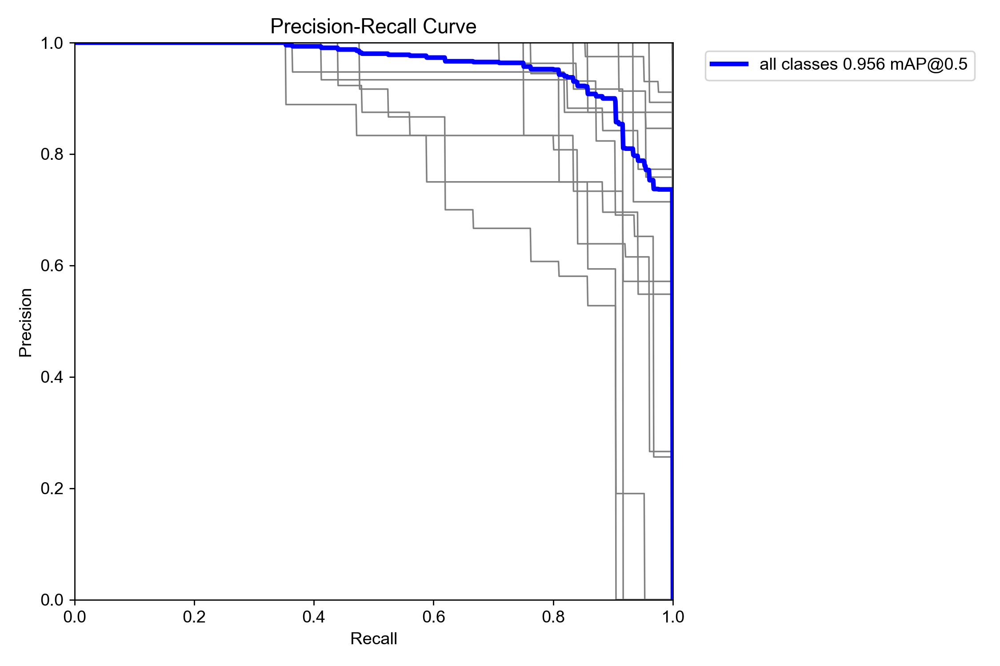
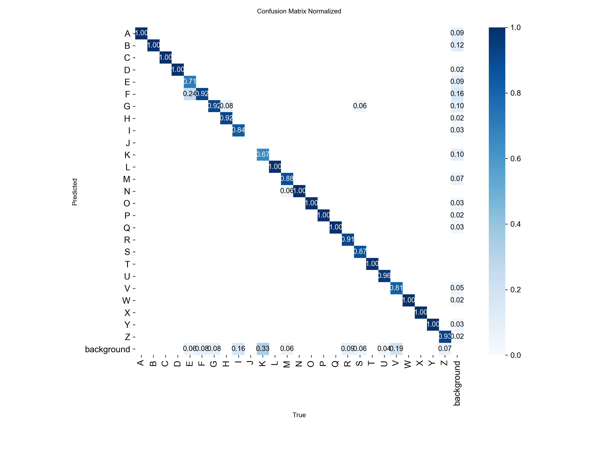

# YOLO-based-ISL-Recognition
# ISL-YOLOv26: Real-Time Indian Sign Language Recognition on Raspberry Pi 5

[](https://www.python.org/)
[](https://ultralytics.com/)
[](LICENSE)


---

## Overview

This repository provides the complete training, evaluation, quantization, 
and deployment pipeline for real-time Indian Sign Language (ISL) alphabet 
recognition using YOLOv26 on Raspberry Pi 5.

### Key Results

| Model | mAP@50 | FPS (Pi5) | Alphabets Detected | Conf (%) |
|---|---|---|---|---|
| YOLOv26s(Aug) — **Proposed** | **95.82%** | 6.4 | **20/25** | 70 |
| YOLOv26s | 94.98% | 6.4 | 12/25 | 60 |
| YOLOv26n | 90.11% | 13.0 | 12/25 | 65 |
| YOLOv11n | 96.99% | 12.0 | 14/25 | 70 |
| RT-DETR | 93.12% | 1.0 | 25/25 | 75 |

**Core finding:** High benchmark mAP does not guarantee live 
full-alphabet recognition. YOLOv26s(Aug) achieves the best balance 
of recognition completeness and real-time performance on edge hardware.

---

## Dataset

The custom ISL dataset contains:
- **2,582 images** across **25 static ISL alphabet classes** (A–Z, excluding J)
- **4,384 annotation instances** in YOLO format
- Collected under diverse lighting conditions from 50–60 volunteers aged 18–25
- Annotated using CVAT tool

### Access

Due to participant privacy constraints, the full dataset is available 
upon request.

**To request access:**  
Email the corresponding author at: satwinderkaur1219@gmail.com  
Subject line: `[ISL Dataset Request] — Satwinder Kaur, UIET, Panjab University`  
Requests are reviewed within 14 working days.

A sample of 15 images (one per class) is available in `dataset/sample_images/`.

---

## Installation

### Desktop / Training Environment

```bash
git clone https://github.com/YOUR_USERNAME/ISL-YOLOv26-RaspberryPi5.git
cd ISL-YOLOv26-RaspberryPi5

conda create -n yolo26 python=3.10
conda activate yolo26

pip install -r requirements.txt
```

### Raspberry Pi 5 (Deployment Only)

```bash
pip install -r deployment/requirements_pi5.txt
```

---

## Training

### Proposed Model — YOLOv26s with Augmentation

```python
from ultralytics import YOLO

model = YOLO('yolov26s.pt')

model.train(
    data='isl_dataset.yaml',
    epochs=150,
    imgsz=640,
    batch=16,
    patience=30,
    cos_lr=True,
    mosaic=1.0,
    flipud=0.3,
    degrees=15.0,
    hsv_s=0.7,
    hsv_v=0.4,
    scale=0.5,
    workers=0,
    pretrained=True,
    project='ISL_v3',
    name='yolo26saug_full'
)
```

Or run directly:

```bash
python training/train_yolo26s_aug.py
```

### Baseline — YOLOv26s without Augmentation

```bash
python training/train_yolo26s.py
```

---

## Evaluation

Generate PR curves, confusion matrices, and all Table 2 metrics:

```bash
python evaluation/evaluate.py --weights weights/yolo26s_aug_best.pt \
                               --data isl_dataset.yaml \
                               --plots True
```

Reproduce the full 13-model comparison:

```bash
python evaluation/compare_models.py
```

Results are saved to `results/`.

---

## Quantization

Export to FP16 TFLite for Raspberry Pi 5 deployment:

```bash
python quantization/export_fp16.py --weights weights/yolo26s_aug_best.pt
```

This reduces model size from ~20.1 MB to ~10.1 MB with no measurable 
accuracy loss on this task.

---

## Deployment on Raspberry Pi 5

Run real-time ISL recognition on Pi 5 webcam:

```bash
python deployment/inference_pi5.py \
    --weights weights/yolo26s_aug_fp16.tflite \
    --source 0 \
    --conf 0.70 \
    --show True
```

### Hardware Setup
- **Board:** Raspberry Pi 5 (BCM2712, 16GB RAM)
- **Camera:** Logitech C920 HD Pro via USB 3.0
- **Resolution:** 1920×1080 captured, 640×640 inference
- **Distance:** 1.5 metres from signer
- **Display:** HDMI at 1920×1080

---

## Model Weights

Pre-trained weights are hosted on Zenodo:

| Model | Format | Size | Link |
|---|---|---|---|
| YOLOv26s(Aug) | PyTorch (.pt) | 20.1 MB | [Download](ZENODO_LINK) |
| YOLOv26s(Aug) | FP16 TFLite | 10.1 MB | [Download](ZENODO_LINK) |
| YOLOv26n | PyTorch (.pt) | 5.4 MB | [Download](ZENODO_LINK) |

---

## Results

### Precision-Recall Curves


### Confusion Matrix — YOLOv26s(Aug)


---

## ISL Alphabet Classes (A-Z)
J is excluded as it requires dynamic hand motion incompatible 
with static frame-based detection.
